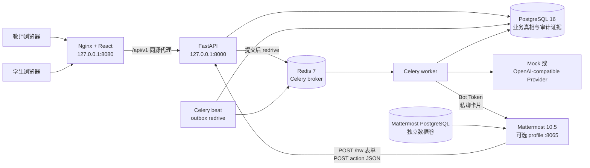
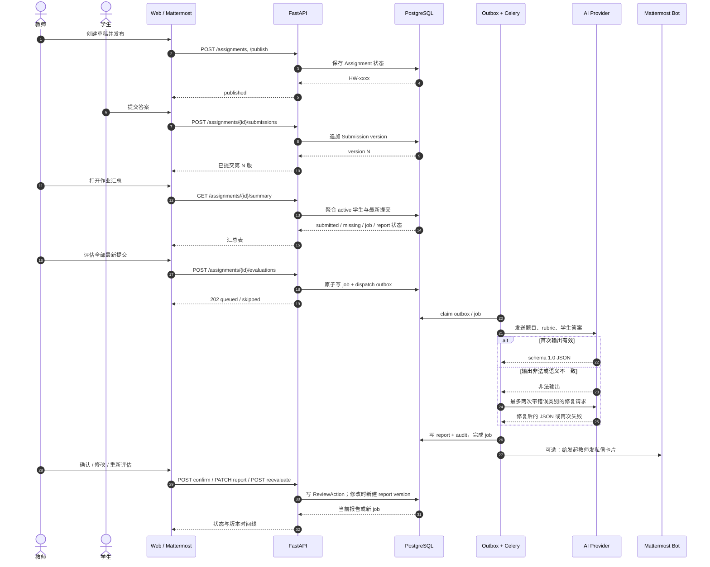
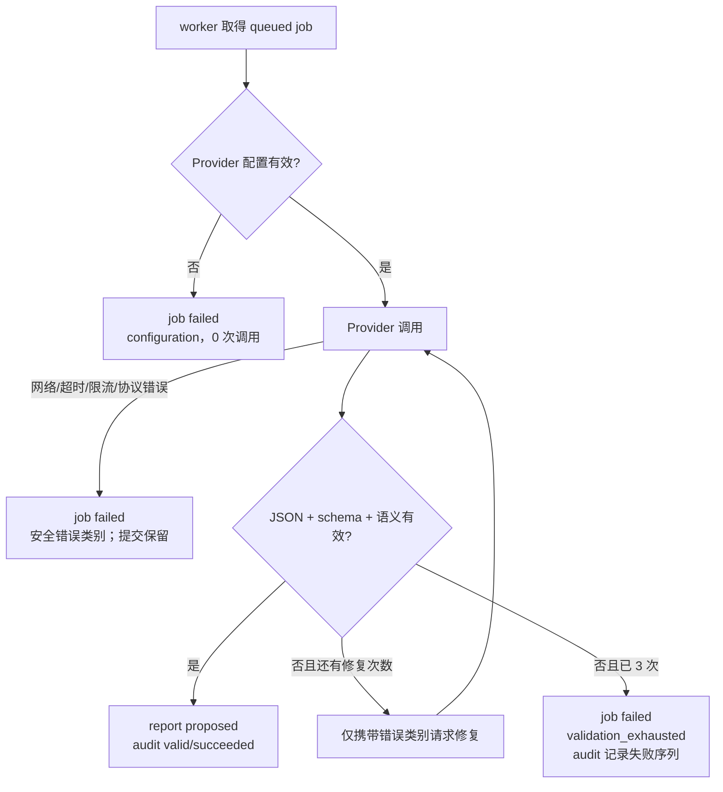

# 系统架构与一致性设计

## 组件边界

默认 `make demo` 不启动 Mattermost；`make demo-full` 才启用 `mattermost` profile。浏览器只接触 Nginx 与 API，Provider Key 和 Mattermost Bot Token 不进入前端。API 持有 Slash Token、Action Secret 与控制台地址；Bot Token 只注入 worker。

## 主流程时序

## 数据所有权

| 数据 | 权威组件 | 关键规则 |
| --- | --- | --- |
| 身份与角色 | PostgreSQL `users` + FastAPI JWT | 登录后 JWT 声明只作入口；敏感操作会重新检查数据库中的 active/role。 |
| 作业 | `assignments` | 教师创建；状态按 `draft → published → closed ↔ published` 的服务规则转换。学生读取不包含 rubric、创建者或频道字段。 |
| 提交版本 | `submissions` | 每个 `(assignment_id, student_id)` 独立递增；新提交追加版本，不覆盖旧答案；Web 与 Mattermost 共用服务。 |
| 汇总 | 查询投影 | 从 active 学生、最新 submitted 版本、最新 job 和未 superseded 报告实时聚合，不另存一份可漂移缓存。 |
| 评估任务 | `evaluation_jobs` | `requested_by` 绑定发起教师；状态是 `queued/running/succeeded/failed/cancelled`；worker 以数据库为真相。 |
| 评估报告 | `evaluation_reports` | 每份提交按版本追加。Agent 报告、教师修订与来源报告形成 lineage；内容不可原地覆盖。 |
| 教师审核 | `review_actions` | 确认、修改、重评各自留下教师、时间、评论和 changes；大幅改分必须写评论。 |
| Agent 审计 | `audit_logs` | 每个 job 一份，记录校验状态、重试类别、最终报告或安全错误；数据库触发器禁止更新/删除/截断。 |
| Mattermost 身份 | `mattermost_identities` | 不可变 Mattermost User ID 绑定本地 user；username 只用于显示，不作授权。 |
| 外部请求证据 | `integration_events` | Slash/action 请求哈希唯一；终态响应持久化，重放返回同一结果。 |
| 异步投递 | `evaluation_outbox` | job dispatch 与 notification 各至多一条；租约、重试时间、最终投递/失败证据均在数据库。 |

## 幂等与并发

### 评估请求

初评 key 为 `SHA-256(submission_id:version:reason)`；人工重评再加入 `source_report_id`。数据库对 `evaluation_jobs.idempotency_key` 设唯一约束，批量插入使用 `ON CONFLICT DO NOTHING`，因此重复点击返回既有 job，汇总中的 `skipped` 明确展示未重复入队数量。

job 与 dispatch outbox 在同一事务提交。只有事务成功后才尝试投递 Celery；如果 broker 暂时不可用，beat 可从持久 outbox 重驱。worker 还以 PostgreSQL advisory lock 围住单个 job，避免同一任务并发执行两次。

### Mattermost 请求

Slash 请求哈希覆盖 `team_id/channel_id/user_id/command/text/trigger_id`，不含 Token；Action 请求哈希覆盖 `user_id/post_id/channel_id/team_id/action/report_id/delivery_id`，不含 HMAC。字段用长度前缀分帧后 SHA-256，`integration_events.request_hash` 唯一。业务写入、事件终态和响应在同一事务内完成；完全相同的重放返回已保存响应，不重复发布、提交或审核。

### 提交版本

版本号由数据库事务和唯一约束 `(assignment_id, student_id, version)` 共同保护。系统不把“最后一次前端读取”当作并发真相，所有页面在变更后重新读取汇总或时间线。

## 报告不可变规则

- Agent 成功后生成一个新的 `evaluation_reports` 版本；报告结构固定为 schema `1.0`。
- 教师“修改评估”不会覆盖 Agent 内容，而是创建 `origin=teacher` 的下一版本，并把来源版本标为 `superseded`。
- 确认只改变当前 `proposed` 报告的审核状态，并追加 `ReviewAction`；不会改写分数、问题或建议。
- 重新评估保存 `source_report_id`，新 Agent 报告继续追加版本；旧报告仍可在时间线查看。
- PostgreSQL trigger 阻止任意修改报告的证据字段、破坏 lineage、删除/截断受保护的报告与审计证据。

## Provider 错误与非法输出

非法输出最多尝试三次（初次 + 两次修复）。成功修复的报告标记 `validation_status=repaired`；耗尽后不生成伪报告，job 标为 `failed`。Provider 的私有错误详情不会进入公共响应，原始学生提交始终保留，教师可在汇总中看到安全错误状态并决定是否重试。

## 部署与迁移边界

业务 ORM 事务会获取共享 advisory gate，Alembic 使用同一稳定 key 的排他 gate。首次从 `0005_mattermost` 或更早版本升级时，操作者必须停止旧 API/worker/beat 和其他数据库会话，并仅对该次迁移设置 `MIGRATION_LEGACY_PROCESSES_STOPPED=true`。迁移自己还会检查 `pg_stat_activity`；发现其他 client backend 就原子拒绝，不会自动终止任何进程。
